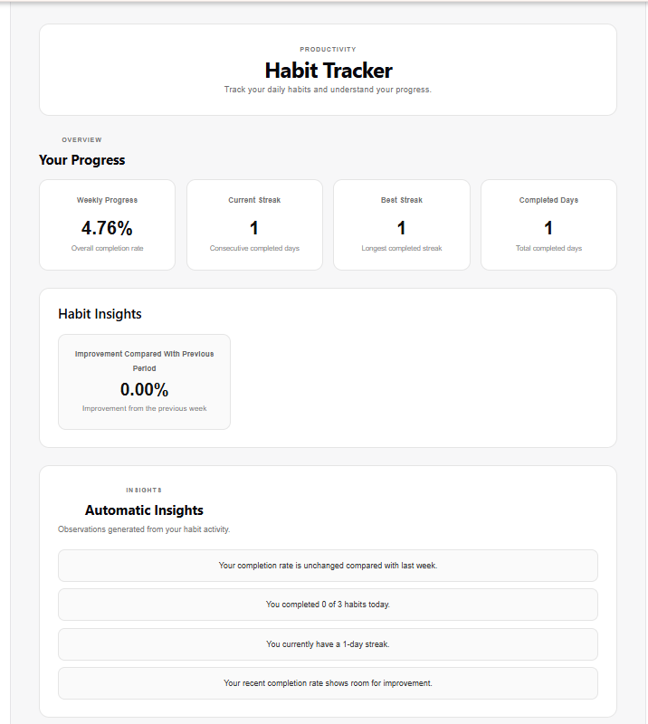
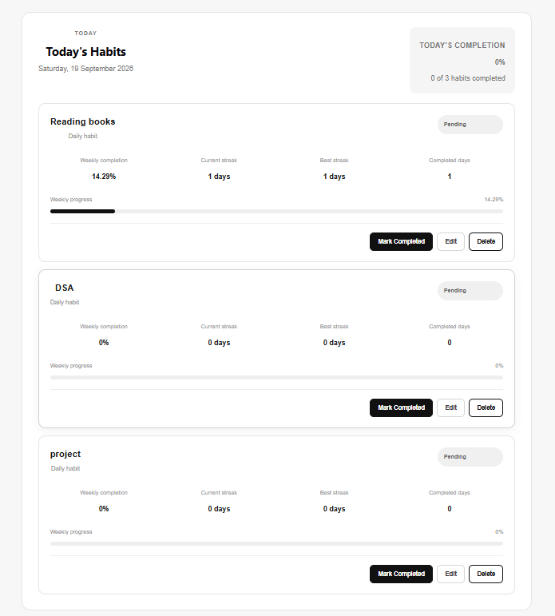
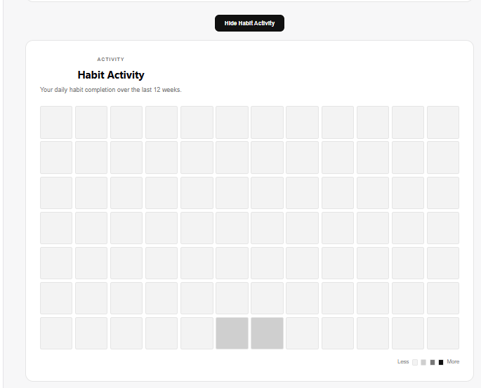
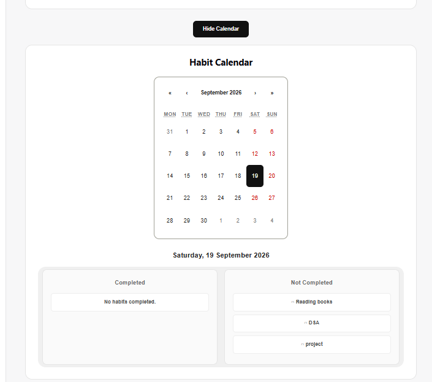
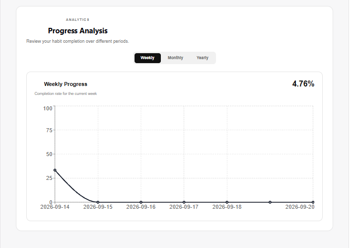

# Habit Tracker

A full-stack habit tracking and analytics application that helps users monitor daily habits, analyze progress, and understand long-term consistency through data visualization and automatic insights.

## Features

- Add and manage daily habits
- Mark habits as completed or not completed
- Track daily habit history
- Weekly completion analysis
- Monthly completion analysis
- Yearly completion analysis
- Habit calendar with completion status
- Habit streak tracking
- 12-week habit activity heatmap
- Automatic habit insights
- Habit trend detection
- Interactive data visualization
- One-click application launcher for Windows

## Tech Stack

### Frontend
- React
- Vite
- Recharts
- CSS

### Backend
- Python
- FastAPI
- SQLAlchemy
- Uvicorn

### Database
- SQLite

## Project Structure

```text
Habit Tracker Project/
│
├── backend/
│   ├── analytics.py
│   ├── database.py
│   ├── main.py
│   ├── models.py
│   ├── schemas.py
│   ├── requirements.txt
│   └── venv/
│
├── frontend/
│   ├── src/
│   │   ├── components/
│   │   ├── pages/
│   │   ├── services/
│   │   ├── App.jsx
│   │   └── index.css
│   ├── package.json
│   └── vite.config.js
│
├── .gitignore
├── README.md
└── start_habit_tracker.bat
## Screenshots

### Dashboard



### Today's Habits



### Analytics



### Habit Calendar



### Habit Insights and Trend

